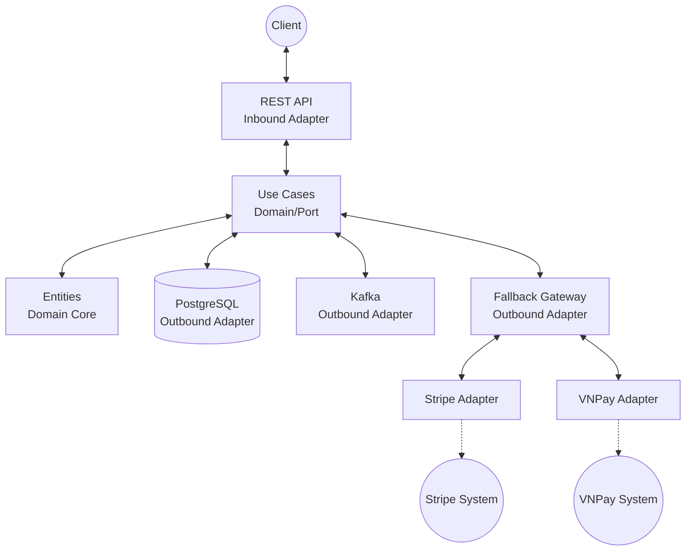

# Payment Service

A scalable and extendable payment processing microservice built with Go.

## 🏗 Architecture Diagram

This project follows **Hexagonal Architecture** (Ports and Adapters) paired with the Strategy/Registry pattern for managing multiple payment gateways seamlessly (Stripe, VNPay, etc.).



## ⚙️ Prerequisites

To run this application, you will need:
- [Go](https://go.dev/dl/) 1.25+
- [Docker](https://docs.docker.com/get-docker/) & Docker Compose
- `make` utility
- Keys for third-party providers (configured in `config/config.yaml` or `.env`):
  - Stripe API Key
  - VNPay credentials (TmnCode, HashSecret)

## 🚀 Quick Start

1. **Clone the repository and set up environment variables:**
   ```bash
   cp .env.example .env
   # Update your .env with valid Stripe/VNPay keys, Database URLs, etc.
   ```

2. **Run all services locally using Docker Compose:**
   ```bash
   make dev
   ```
   This command will spin up the database, Kafka, and the API server.

3. **Check the health of the application:**
   The API server default port can be configured in `.env` (e.g., 5290).
   ```bash
   curl http://localhost:5290/health
   ```

## 🔌 API Endpoints

The API is protected by an API Key middleware. You must include the `X-API-Key` in your request headers. *(Default is configured via `SERVER_API_KEY` in environment variables)*.

### 1. Create a Payment
```bash
curl -X POST http://localhost:5290/api/v1/payments \
  -H "X-API-Key: your_super_secret_api_key_here" \
  -H "Content-Type: application/json" \
  -d '{
    "order_id": "ORD-12345",
    "amount": 100.0,
    "currency": "USD",
    "payment_method": "CARD"
  }'
```

### 2. Get Payment Status
```bash
curl -X GET http://localhost:5290/api/v1/payments/<payment_id> \
  -H "X-API-Key: your_super_secret_api_key_here"
```

### 3. Refund Payment
```bash
curl -X POST http://localhost:5290/api/v1/payments/<payment_id>/refund \
  -H "X-API-Key: your_super_secret_api_key_here" \
  -H "Content-Type: application/json" \
  -d '{
    "reason": "customer_requested"
  }'
```

### 4. Cancel Payment
```bash
curl -X DELETE http://localhost:5290/api/v1/payments/<payment_id> \
  -H "X-API-Key: your_super_secret_api_key_here"
```

## 🧩 Adding a New Gateway (E.g., VNPay)

The system is designed so that adding a new payment gateway provider does not require changes to the core business logic.

1. **Implement the Outbound Adapter**:
   Create a new package in `internal/adapters/outbound/<gateway_name>` which implements the `port.PaymentGatewayPlugin` interface.
   
   ```go
   type PaymentGatewayPlugin interface {
       Process(...) error
       Refund(...) error
   }
   ```

2. **Register the Gateway in the Factory** (`cmd/server/main.go`):
   Pass the new gateway implementation to the `Registry` via `WireGateway`. You can assign priority levels and routing rules (such as matching supported currencies and payment methods).
   
   ```go
   // Define strategies in cmd/server/main.go
   registry := gatewaypkg.NewRegistry().
       Register(gatewaypkg.GatewayEntry{
           Name:     gatewaypkg.GatewayStripe,
           Gateway:  stripeGW,
           Priority: 1, 
           Enabled:  true,
           SupportedMethods:    []entity.PaymentMethod{entity.MethodCard},
           SupportedCurrencies: []string{"USD", "EUR"},
       }).
       Register(gatewaypkg.GatewayEntry{
           Name:     "VNPAY",
           Gateway:  vnpayGW,
           Priority: 2, 
           Enabled:  true,
           SupportedMethods:    []entity.PaymentMethod{entity.MethodBankTransfer},
           SupportedCurrencies: []string{"VND"},
       })
   ```

## 🧪 Test & Deploy Instructions

### Testing
We use standard Go testing practices and `golangci-lint` for linting.

```bash
# Run all unit tests
make test

# Generate and view test coverage HTML report (requires minimum 95% coverage)
make coverage
```

### Code Quality
```bash
# Run the linter
make lint

# Format code
make fmt
```

### Deployment
This project includes standard Dockerfiles and Helm charts for Kubernetes deployment.

```bash
# Build the go binary
make build

# Build the docker image
make docker

# Push to standard registry
make docker-push
```

#### Kubernetes / Helm Deployments:
Deployment targets are managed via `Makefile`. Before deploying, assure `kubeconfig` is set properly.

```bash
# Deploy to staging environment
make deploy-staging

# Deploy to production environment
make deploy-prod
```
